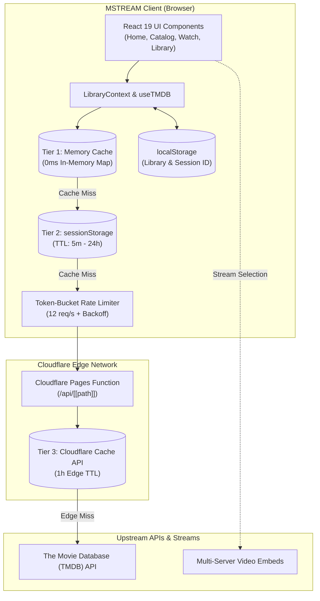

<div align="center">
  <a href="https://mstream.eu.cc/">
    
  </a>

  # MSTREAM

  <p><strong>A Modern, Fast, and Ad-Free Cinema Streaming Experience</strong></p>

  <p>
    <a href="https://github.com/cd-Crypton/mstream/blob/main/LICENSE"></a>
    <a href="https://react.dev/"></a>
    <a href="https://vitejs.dev/"></a>
    <a href="https://pnpm.io/"></a>
    <a href="https://pages.cloudflare.com/"></a>
    <a href="https://web.dev/progressive-web-apps/"></a>
  </p>

  <p>
    <a href="https://mstream.eu.cc/"><strong>Explore Live Demo »</strong></a>
    <br />
    <a href="#-key-features">Key Features</a> •
    <a href="#-system-architecture">Architecture</a> •
    <a href="#-getting-started">Getting Started</a> •
    <a href="#-deployment">Deployment</a> •
    <a href="#-documentation">Documentation</a>
  </p>
</div>

---

## 📽️ Overview

**MSTREAM** is an open-source, cinema-grade movie and TV show streaming web application powered by **The Movie Database (TMDB) API** and modern React 19. Designed with an ultra-clean **OLED Cinema Dark** aesthetic, MSTREAM delivers instantaneous catalog browsing, zero-lag page transitions, multi-provider playback options, and an account-free persistent library that stays in sync across your browser tabs.

Built specifically for high-speed delivery, it deploys seamlessly to **Cloudflare Pages** with an edge caching proxy and full Progressive Web App (PWA) offline precaching.

---

## ✨ Key Features

- 🎬 **Cinema-Grade Interface**: Immersive OLED dark theme (`#07070a`), glassmorphic overlays, fluid hover micro-interactions, and responsive layout perfected for both desktop monitors and mobile touchscreens.
- 💾 **Account-Free Persistent Library**:
  - Save movies and TV shows to your personal library with one click.
  - Zero registration or login required — persists automatically in `localStorage`.
  - **Live Cross-Tab Sync**: Add a title in one tab, and all other open tabs reflect the change instantly via storage event synchronization.
  - Dedicated `/library` view with instant search filtering, category tabs, and live navbar badges.
- ⚡ **Multi-Tiered Performance Caching**:
  - **Tier 1 (Memory)**: 0ms instantaneous lookup for catalog lists, genres, and page transitions.
  - **Tier 2 (`sessionStorage`)**: Keeps loaded content instant across browser refreshes.
  - **In-Flight Deduplication**: Simultaneous components requesting the same TMDB endpoint share a single network Promise.
  - **Cloudflare Edge Cache**: Edge proxy (`functions/api/[[path]].js`) caches upstream TMDB JSON responses with `X-Cache-Status` headers.
- 🛡️ **Client Rate Limiting & Debounce**:
  - Built-in token-bucket algorithm (max 12 req/sec) with automatic exponential backoff on `429` responses.
  - 280ms search query debouncing prevents unnecessary API spam while typing.
- 📺 **Multi-Server Streaming Player**:
  - 7+ independent embed streaming servers with quick-switching failover.
  - Interactive season and episode pickers for TV series.
  - Clean cinema playback mode and sandbox security controls.
- 📱 **Installable Progressive Web App (PWA)**:
  - Installable on iOS, Android, macOS, and Windows.
  - Workbox service worker precaching for static assets and offline shell loading.
- 🔍 **Advanced Discovery & Filtering**:
  - Filter by release year, genre, certification, sort order, and keyword search.
  - Dynamic segmented switch for "This Week" vs. "Today" trending items.

---

## 🏗️ System Architecture



---

## 🛠️ Technology Stack

| Layer | Technologies |
| :--- | :--- |
| **Frontend Framework** | [React 19](https://react.dev/), [React DOM 19](https://react.dev/) |
| **Routing** | [React Router v7](https://reactrouter.com/) |
| **Build Tool & Bundler** | [Vite 7](https://vitejs.dev/) |
| **Package Manager** | [pnpm](https://pnpm.io/) |
| **Edge & Hosting** | [Cloudflare Pages](https://pages.cloudflare.com/), [Wrangler](https://developers.cloudflare.com/workers/wrangler/) |
| **PWA & Offline** | [vite-plugin-pwa](https://vite-pwa-org.netlify.app/), Workbox |
| **Styling & Design** | Modern CSS3 Variables, Glassmorphism, Responsive Grid/Flexbox |
| **Data Source** | [The Movie Database (TMDB) API v3](https://developer.themoviedb.org/reference/intro/getting-started) |

---

## 🚀 Getting Started

### Prerequisites

- [Node.js](https://nodejs.org/) (version **18.0.0** or higher)
- [pnpm](https://pnpm.io/installation) (version **9.x** or higher)
- A free API Read Access Token from [The Movie Database (TMDB)](https://www.themoviedb.org/settings/api)

### 1. Clone the Repository

```bash
git clone https://github.com/cd-Crypton/mstream.git
cd mstream
```

### 2. Install Dependencies

Always use **pnpm** for package installation:

```bash
pnpm install
```

### 3. Configure Environment Variables

Copy the sample environment file to `.env`:

```bash
cp .env.example .env
```

Open `.env` and fill in your TMDB Read Access Token:

```ini
# TMDB API Read Access Token (from https://www.themoviedb.org/settings/api)
VITE_TMDB_READ_ACCESS_TOKEN=your_tmdb_read_access_token_here

# TMDB Base URL and Image CDN Endpoints
VITE_TMDB_BASE_URL=https://api.themoviedb.org/3
VITE_BACKDROP_URL=https://image.tmdb.org/t/p/w500
VITE_POSTER_URL=https://image.tmdb.org/t/p/w1280
```

### 4. Start the Local Development Server

```bash
pnpm run dev
```

Open [http://localhost:5173](http://localhost:5173) in your browser to start exploring.

---

## 📜 Available Scripts

All scripts must be executed using **pnpm**:

| Command | Description |
| :--- | :--- |
| `pnpm run dev` | Starts the Vite development server with Hot Module Replacement (HMR). |
| `pnpm run build` | Compiles production bundle to `/dist` and generates the PWA service worker. |
| `pnpm run preview` | Builds the project and starts a local Cloudflare Pages runtime with Wrangler. |
| `pnpm run deploy` | Builds and deploys the project directly to Cloudflare Pages via Wrangler. |
| `pnpm run lint` | Runs ESLint to verify code quality and style. |
| `pnpm run format:check` | Checks source code formatting with Prettier. |
| `pnpm run format:fix` | Automatically formats all JS, JSX, and CSS files with Prettier. |

---

## ☁️ Deployment

### Option 1: Cloudflare Pages (Git Integration — Recommended)

1. Push your code or fork this repository to GitHub/GitLab.
2. Log into the [Cloudflare Dashboard](https://dash.cloudflare.com/) and navigate to **Workers & Pages** > **Create Application** > **Pages** > **Connect to Git**.
3. Select the `mstream` repository.
4. Configure your build settings:
   - **Framework preset**: `None`
   - **Build command**: `pnpm run build`
   - **Build output directory**: `dist`
   - **Root directory**: `/` (or left blank)
5. Under **Environment variables**, add:
   - `VITE_TMDB_READ_ACCESS_TOKEN`: *(Your TMDB Read Access Token)*
   - `VITE_TMDB_BASE_URL`: `https://api.themoviedb.org/3`
   - `VITE_BACKDROP_URL`: `https://image.tmdb.org/t/p/w500`
   - `VITE_POSTER_URL`: `https://image.tmdb.org/t/p/w1280`
6. Click **Save and Deploy**. Cloudflare Pages will automatically execute the edge worker in `functions/api/[[path]].js` to proxy and cache TMDB requests.

### Option 2: CLI Deployment with Wrangler

```bash
# Authenticate with Cloudflare
pnpm wrangler login

# Build and deploy
pnpm run deploy
```

---

## 📂 Project Structure

```text
mstream/
├── .agents/                 # AI Assistant skills & agent toolkits
├── docs/                    # Architectural & in-depth technical documentation
│   └── ARCHITECTURE.md      # Tiered cache, rate limiting, and session design
├── functions/
│   └── api/
│       └── [[path]].js      # Cloudflare Pages edge proxy with Cache API
├── public/                  # Static assets, web manifest, and logos
├── src/
│   ├── assets/              # Branding images and icons
│   ├── components/          # Reusable UI components
│   │   ├── BannerSlider.jsx # Hero carousel with video backdrop
│   │   ├── Icons.jsx        # Lightweight inline SVG icon set
│   │   ├── Modal.jsx        # Item detail modal dialog
│   │   ├── MovieCard.jsx    # Poster card with bookmark & hover states
│   │   ├── MovieRow.jsx     # Horizontal/grid category row
│   │   ├── Navbar.jsx       # Responsive navigation with live Library counter
│   │   └── SearchModal.jsx  # Fullscreen search modal
│   ├── context/
│   │   └── LibraryContext.jsx # Reactive library state with cross-tab sync
│   ├── hooks/
│   │   └── useTMDB.js       # TMDB API hook with deduplication & caching
│   ├── pages/               # Main route views
│   │   ├── Home.jsx         # Trending hero, segmented window toggle
│   │   ├── Movies.jsx       # Filterable movies catalog
│   │   ├── TVShows.jsx      # Filterable TV shows catalog
│   │   ├── Popular.jsx      # Popular titles catalog
│   │   ├── Library.jsx      # Personal saved titles with instant filter
│   │   └── Watch.jsx        # Multi-server streaming player & episodes
│   ├── services/            # Core business logic & performance services
│   │   ├── apiCache.js      # Memory + sessionStorage multi-tier cache
│   │   ├── rateLimiter.js   # Token bucket limiter & exponential backoff
│   │   └── sessionManager.js# Anonymous device ID & preference manager
│   ├── styles/              # Global cinema styles & variables
│   │   ├── design-tokens.css# Colors, spacing, radii, blur tokens
│   │   ├── components.css   # Reusable component classes
│   │   └── pages.css        # Page layout styles
│   ├── App.jsx              # Main routing & provider composition
│   └── main.jsx             # React DOM entry point & PWA registration
├── index.html               # HTML entry with metadata & SEO tags
├── package.json             # Scripts & dependencies
├── vite.config.js           # Vite configuration with PWA plugin
└── wrangler.jsonc           # Cloudflare Pages configuration
```

---

## 📚 Additional Documentation

- [System Architecture & Caching Deep Dive](docs/ARCHITECTURE.md): Comprehensive breakdown of the caching tiers, token-bucket rate limiter, cross-tab synchronization, and edge worker implementation.
- [Contributing Guide](CONTRIBUTING.md): Standards for PRs, conventional commits, and code formatting.

---

## 🤝 Contributing

Contributions are welcomed! Whether it is a bug fix, new server integration, or UI polish:

1. Fork the repository.
2. Create your feature branch (`git checkout -b feat/amazing-feature`).
3. Commit your changes using [Conventional Commits](https://www.conventionalcommits.org/) (`git commit -m 'feat: add amazing feature'`).
4. Ensure code adheres to standards:
   ```bash
   pnpm run lint
   pnpm run format:check
   ```
5. Push to your branch (`git push origin feat/amazing-feature`).
6. Open a Pull Request.

---

## ⚖️ License & Disclaimer

This project is licensed under the [MIT License](LICENSE).

> **Disclaimer**: MSTREAM does not host, store, or stream any media files directly on its servers. All streaming links and metadata are retrieved via third-party iframe embeds and public APIs (such as The Movie Database). MSTREAM operates solely as an open-source indexing client.
